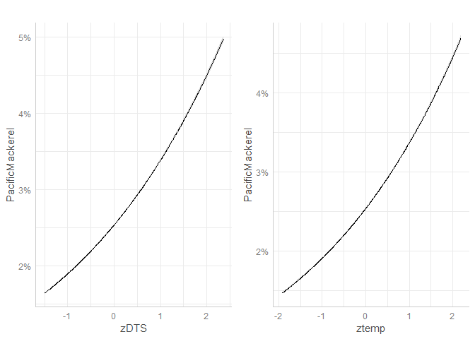
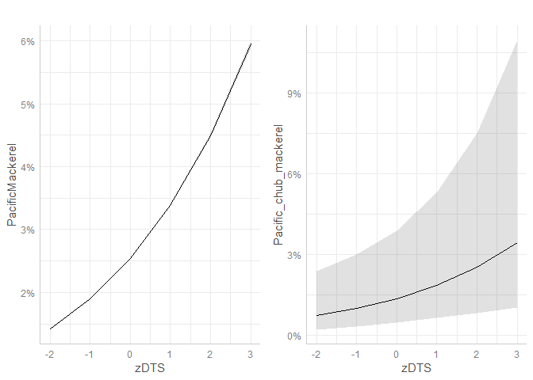

## Data wrangling

SWFSC data: For these data we removed all night tows (n = 5) and samples using the fine mesh liner (n = 32). These conditions generally only affected sampling in 2016 with 2 of the night tows occurring in 2015. We also removed tows that occurred in August (n = 5) as these samples only occurred in 2015. The remaining dataset (n = 518) represents samples that occurred in June, July and September in 2010-2016.

JSOES data: For these data we Cheryl's advice and guidance as to what we included/excluded in the analysis. Major exclusions included reducing May samples to the years 1999, 2006-2012. We also excluded any tow where Study Type did not equal "regular".  We also removed all samples that occurred at night (n = 31).


```r
shelf %>%
  group_by(Study,Year,Month) %>%
  summarize(count=n()) %>%
  kbl() %>%
  kable_styling()
```

<table class="table" style="margin-left: auto; margin-right: auto;">
 <thead>
  <tr>
   <th style="text-align:left;"> Study </th>
   <th style="text-align:left;"> Year </th>
   <th style="text-align:left;"> Month </th>
   <th style="text-align:right;"> count </th>
  </tr>
 </thead>
<tbody>
  <tr>
   <td style="text-align:left;"> JSOES </td>
   <td style="text-align:left;"> 1998 </td>
   <td style="text-align:left;"> June </td>
   <td style="text-align:right;"> 35 </td>
  </tr>
  <tr>
   <td style="text-align:left;"> JSOES </td>
   <td style="text-align:left;"> 1998 </td>
   <td style="text-align:left;"> September </td>
   <td style="text-align:right;"> 35 </td>
  </tr>
  <tr>
   <td style="text-align:left;"> JSOES </td>
   <td style="text-align:left;"> 1999 </td>
   <td style="text-align:left;"> June </td>
   <td style="text-align:right;"> 23 </td>
  </tr>
  <tr>
   <td style="text-align:left;"> JSOES </td>
   <td style="text-align:left;"> 1999 </td>
   <td style="text-align:left;"> May </td>
   <td style="text-align:right;"> 9 </td>
  </tr>
  <tr>
   <td style="text-align:left;"> JSOES </td>
   <td style="text-align:left;"> 1999 </td>
   <td style="text-align:left;"> September </td>
   <td style="text-align:right;"> 43 </td>
  </tr>
  <tr>
   <td style="text-align:left;"> JSOES </td>
   <td style="text-align:left;"> 2000 </td>
   <td style="text-align:left;"> June </td>
   <td style="text-align:right;"> 22 </td>
  </tr>
  <tr>
   <td style="text-align:left;"> JSOES </td>
   <td style="text-align:left;"> 2000 </td>
   <td style="text-align:left;"> September </td>
   <td style="text-align:right;"> 17 </td>
  </tr>
  <tr>
   <td style="text-align:left;"> JSOES </td>
   <td style="text-align:left;"> 2001 </td>
   <td style="text-align:left;"> June </td>
   <td style="text-align:right;"> 42 </td>
  </tr>
  <tr>
   <td style="text-align:left;"> JSOES </td>
   <td style="text-align:left;"> 2001 </td>
   <td style="text-align:left;"> September </td>
   <td style="text-align:right;"> 40 </td>
  </tr>
  <tr>
   <td style="text-align:left;"> JSOES </td>
   <td style="text-align:left;"> 2002 </td>
   <td style="text-align:left;"> June </td>
   <td style="text-align:right;"> 35 </td>
  </tr>
  <tr>
   <td style="text-align:left;"> JSOES </td>
   <td style="text-align:left;"> 2002 </td>
   <td style="text-align:left;"> September </td>
   <td style="text-align:right;"> 38 </td>
  </tr>
  <tr>
   <td style="text-align:left;"> JSOES </td>
   <td style="text-align:left;"> 2003 </td>
   <td style="text-align:left;"> June </td>
   <td style="text-align:right;"> 49 </td>
  </tr>
  <tr>
   <td style="text-align:left;"> JSOES </td>
   <td style="text-align:left;"> 2003 </td>
   <td style="text-align:left;"> September </td>
   <td style="text-align:right;"> 34 </td>
  </tr>
  <tr>
   <td style="text-align:left;"> JSOES </td>
   <td style="text-align:left;"> 2004 </td>
   <td style="text-align:left;"> June </td>
   <td style="text-align:right;"> 45 </td>
  </tr>
  <tr>
   <td style="text-align:left;"> JSOES </td>
   <td style="text-align:left;"> 2004 </td>
   <td style="text-align:left;"> September </td>
   <td style="text-align:right;"> 29 </td>
  </tr>
  <tr>
   <td style="text-align:left;"> JSOES </td>
   <td style="text-align:left;"> 2005 </td>
   <td style="text-align:left;"> August </td>
   <td style="text-align:right;"> 24 </td>
  </tr>
  <tr>
   <td style="text-align:left;"> JSOES </td>
   <td style="text-align:left;"> 2005 </td>
   <td style="text-align:left;"> June </td>
   <td style="text-align:right;"> 19 </td>
  </tr>
  <tr>
   <td style="text-align:left;"> JSOES </td>
   <td style="text-align:left;"> 2005 </td>
   <td style="text-align:left;"> September </td>
   <td style="text-align:right;"> 39 </td>
  </tr>
  <tr>
   <td style="text-align:left;"> JSOES </td>
   <td style="text-align:left;"> 2006 </td>
   <td style="text-align:left;"> June </td>
   <td style="text-align:right;"> 44 </td>
  </tr>
  <tr>
   <td style="text-align:left;"> JSOES </td>
   <td style="text-align:left;"> 2006 </td>
   <td style="text-align:left;"> May </td>
   <td style="text-align:right;"> 21 </td>
  </tr>
  <tr>
   <td style="text-align:left;"> JSOES </td>
   <td style="text-align:left;"> 2006 </td>
   <td style="text-align:left;"> September </td>
   <td style="text-align:right;"> 53 </td>
  </tr>
  <tr>
   <td style="text-align:left;"> JSOES </td>
   <td style="text-align:left;"> 2007 </td>
   <td style="text-align:left;"> June </td>
   <td style="text-align:right;"> 44 </td>
  </tr>
  <tr>
   <td style="text-align:left;"> JSOES </td>
   <td style="text-align:left;"> 2007 </td>
   <td style="text-align:left;"> May </td>
   <td style="text-align:right;"> 37 </td>
  </tr>
  <tr>
   <td style="text-align:left;"> JSOES </td>
   <td style="text-align:left;"> 2007 </td>
   <td style="text-align:left;"> September </td>
   <td style="text-align:right;"> 34 </td>
  </tr>
  <tr>
   <td style="text-align:left;"> JSOES </td>
   <td style="text-align:left;"> 2008 </td>
   <td style="text-align:left;"> June </td>
   <td style="text-align:right;"> 36 </td>
  </tr>
  <tr>
   <td style="text-align:left;"> JSOES </td>
   <td style="text-align:left;"> 2008 </td>
   <td style="text-align:left;"> May </td>
   <td style="text-align:right;"> 29 </td>
  </tr>
  <tr>
   <td style="text-align:left;"> JSOES </td>
   <td style="text-align:left;"> 2008 </td>
   <td style="text-align:left;"> September </td>
   <td style="text-align:right;"> 43 </td>
  </tr>
  <tr>
   <td style="text-align:left;"> JSOES </td>
   <td style="text-align:left;"> 2009 </td>
   <td style="text-align:left;"> June </td>
   <td style="text-align:right;"> 36 </td>
  </tr>
  <tr>
   <td style="text-align:left;"> JSOES </td>
   <td style="text-align:left;"> 2009 </td>
   <td style="text-align:left;"> May </td>
   <td style="text-align:right;"> 27 </td>
  </tr>
  <tr>
   <td style="text-align:left;"> JSOES </td>
   <td style="text-align:left;"> 2009 </td>
   <td style="text-align:left;"> September </td>
   <td style="text-align:right;"> 31 </td>
  </tr>
  <tr>
   <td style="text-align:left;"> JSOES </td>
   <td style="text-align:left;"> 2010 </td>
   <td style="text-align:left;"> June </td>
   <td style="text-align:right;"> 41 </td>
  </tr>
  <tr>
   <td style="text-align:left;"> JSOES </td>
   <td style="text-align:left;"> 2010 </td>
   <td style="text-align:left;"> May </td>
   <td style="text-align:right;"> 23 </td>
  </tr>
  <tr>
   <td style="text-align:left;"> JSOES </td>
   <td style="text-align:left;"> 2010 </td>
   <td style="text-align:left;"> September </td>
   <td style="text-align:right;"> 26 </td>
  </tr>
  <tr>
   <td style="text-align:left;"> JSOES </td>
   <td style="text-align:left;"> 2011 </td>
   <td style="text-align:left;"> June </td>
   <td style="text-align:right;"> 37 </td>
  </tr>
  <tr>
   <td style="text-align:left;"> JSOES </td>
   <td style="text-align:left;"> 2011 </td>
   <td style="text-align:left;"> May </td>
   <td style="text-align:right;"> 28 </td>
  </tr>
  <tr>
   <td style="text-align:left;"> JSOES </td>
   <td style="text-align:left;"> 2011 </td>
   <td style="text-align:left;"> September </td>
   <td style="text-align:right;"> 31 </td>
  </tr>
  <tr>
   <td style="text-align:left;"> JSOES </td>
   <td style="text-align:left;"> 2012 </td>
   <td style="text-align:left;"> June </td>
   <td style="text-align:right;"> 30 </td>
  </tr>
  <tr>
   <td style="text-align:left;"> JSOES </td>
   <td style="text-align:left;"> 2012 </td>
   <td style="text-align:left;"> May </td>
   <td style="text-align:right;"> 16 </td>
  </tr>
  <tr>
   <td style="text-align:left;"> JSOES </td>
   <td style="text-align:left;"> 2012 </td>
   <td style="text-align:left;"> September </td>
   <td style="text-align:right;"> 35 </td>
  </tr>
  <tr>
   <td style="text-align:left;"> JSOES </td>
   <td style="text-align:left;"> 2013 </td>
   <td style="text-align:left;"> June </td>
   <td style="text-align:right;"> 27 </td>
  </tr>
  <tr>
   <td style="text-align:left;"> JSOES </td>
   <td style="text-align:left;"> 2014 </td>
   <td style="text-align:left;"> June </td>
   <td style="text-align:right;"> 40 </td>
  </tr>
  <tr>
   <td style="text-align:left;"> JSOES </td>
   <td style="text-align:left;"> 2015 </td>
   <td style="text-align:left;"> June </td>
   <td style="text-align:right;"> 40 </td>
  </tr>
  <tr>
   <td style="text-align:left;"> JSOES </td>
   <td style="text-align:left;"> 2016 </td>
   <td style="text-align:left;"> June </td>
   <td style="text-align:right;"> 41 </td>
  </tr>
  <tr>
   <td style="text-align:left;"> JSOES </td>
   <td style="text-align:left;"> 2017 </td>
   <td style="text-align:left;"> June </td>
   <td style="text-align:right;"> 37 </td>
  </tr>
  <tr>
   <td style="text-align:left;"> JSOES </td>
   <td style="text-align:left;"> 2018 </td>
   <td style="text-align:left;"> June </td>
   <td style="text-align:right;"> 43 </td>
  </tr>
  <tr>
   <td style="text-align:left;"> JSOES </td>
   <td style="text-align:left;"> 2019 </td>
   <td style="text-align:left;"> June </td>
   <td style="text-align:right;"> 47 </td>
  </tr>
  <tr>
   <td style="text-align:left;"> SWFSC </td>
   <td style="text-align:left;"> 2010 </td>
   <td style="text-align:left;"> July </td>
   <td style="text-align:right;"> 21 </td>
  </tr>
  <tr>
   <td style="text-align:left;"> SWFSC </td>
   <td style="text-align:left;"> 2011 </td>
   <td style="text-align:left;"> July </td>
   <td style="text-align:right;"> 38 </td>
  </tr>
  <tr>
   <td style="text-align:left;"> SWFSC </td>
   <td style="text-align:left;"> 2011 </td>
   <td style="text-align:left;"> June </td>
   <td style="text-align:right;"> 6 </td>
  </tr>
  <tr>
   <td style="text-align:left;"> SWFSC </td>
   <td style="text-align:left;"> 2011 </td>
   <td style="text-align:left;"> September </td>
   <td style="text-align:right;"> 26 </td>
  </tr>
  <tr>
   <td style="text-align:left;"> SWFSC </td>
   <td style="text-align:left;"> 2012 </td>
   <td style="text-align:left;"> June </td>
   <td style="text-align:right;"> 13 </td>
  </tr>
  <tr>
   <td style="text-align:left;"> SWFSC </td>
   <td style="text-align:left;"> 2013 </td>
   <td style="text-align:left;"> July </td>
   <td style="text-align:right;"> 6 </td>
  </tr>
  <tr>
   <td style="text-align:left;"> SWFSC </td>
   <td style="text-align:left;"> 2014 </td>
   <td style="text-align:left;"> July </td>
   <td style="text-align:right;"> 1 </td>
  </tr>
  <tr>
   <td style="text-align:left;"> SWFSC </td>
   <td style="text-align:left;"> 2015 </td>
   <td style="text-align:left;"> August </td>
   <td style="text-align:right;"> 7 </td>
  </tr>
  <tr>
   <td style="text-align:left;"> SWFSC </td>
   <td style="text-align:left;"> 2015 </td>
   <td style="text-align:left;"> July </td>
   <td style="text-align:right;"> 6 </td>
  </tr>
  <tr>
   <td style="text-align:left;"> SWFSC </td>
   <td style="text-align:left;"> 2015 </td>
   <td style="text-align:left;"> June </td>
   <td style="text-align:right;"> 14 </td>
  </tr>
  <tr>
   <td style="text-align:left;"> SWFSC </td>
   <td style="text-align:left;"> 2015 </td>
   <td style="text-align:left;"> September </td>
   <td style="text-align:right;"> 36 </td>
  </tr>
  <tr>
   <td style="text-align:left;"> SWFSC </td>
   <td style="text-align:left;"> 2016 </td>
   <td style="text-align:left;"> July </td>
   <td style="text-align:right;"> 3 </td>
  </tr>
  <tr>
   <td style="text-align:left;"> SWFSC </td>
   <td style="text-align:left;"> 2016 </td>
   <td style="text-align:left;"> June </td>
   <td style="text-align:right;"> 24 </td>
  </tr>
</tbody>
</table>

Next, we z-scored all the coavariates such that mean = 0 and sd = 1 given the the vastly different units of each individual covariate.


We can then look at potential correlations between the covaraites and for the most part don't see anything that would be a red flag


```r
ggpairs(shelf[,c("ztemp","zsal","zlat","zDTS")])
```

<!-- -->


We can also look at the range and mean of temp and salinity across the dataset. Both seem pretty stable until we hit 2015 and then things get a bit less so. Salnity, in partiuclar, looks to be relatively high in 2015 and 2019. Or at least measurements do not indicate salinity in the lower range of previous years.


<!-- -->


## Analysis

The major change to our analysis is the inclusion of some temporal interactions for each covariate. Essentially looking at how any observed relationship between species P/A and our covariates change as a function of month. SO we have now added a Month x covariate interaction to each model.We included all first order interactions with Month and use model selection to determine the best overall combination for predicting P/A for each species. We then plot the interactions with significant terms. Northern Anchovy example below.

### *Northern Anchovy*

There were 5 models with equal support (AICc) but model weights ranged from 0.092 to 0.247. All the top models included month, latitude, and salinity and some combination of interactions with month. The "best" model included all the covariates but only the interactions between months for latitude and distance to shore. 


```
## Warning in checkConv(attr(opt, "derivs"), opt$par, ctrl = control$checkConv, :
## unable to evaluate scaled gradient
```

```
## Warning in checkConv(attr(opt, "derivs"), opt$par, ctrl = control$checkConv, :
## Model failed to converge: degenerate Hessian with 1 negative eigenvalues
```

<!-- --><!-- -->

### *Pacific Sardine*

The best models did not include interactions between month and other covaraiates and the best model only includes MOnth, Salinity and distance to shore. Other models supported by AICc but with lower relative model weights included either latitude or temperature.


```
## Data were 'prettified'. Consider using `terms="zsal [all]"` to get smooth plots.
```

<!-- -->

### *Market Squid*

All terms were included in the best model with the exception of the interaction between month and distance to shore. Best model was overwhelmingly supported over other iterations.


```
## Warning in checkConv(attr(opt, "derivs"), opt$par, ctrl = control$checkConv, :
## Model failed to converge with max|grad| = 0.0102755 (tol = 0.001, component 1)
```

<!-- -->

### *Pacific Mackerel*

Pacific mackerel only occurred in 3% of tows for the shelf surveys. Our analysis suggested that the best fit model include only distance offshore and temperature with no variation by month. Both showed a positive effect on presence of Pacific mackerel indicating higher presence in warmer waters farther offshore. However, while the effect for distance offshore and temperature nearly doubled the predicted probability of presence, the predictions remained low (< 5%). Given low presence we should interpret these results with caution.

<!-- -->

### *Jack Mackerel*

Jack mackerel were encountered relatively infrequently (8%) in the shelf survey. The best model for predciitng Jack mackerel present in the shelf survey included all of our covariates as well as their interactions with month with the exception of the month x  distance to shore effect. Distance to shore was the only significant, albeit very weak, effect on Jack mackerel presence. There was considerable variability in Jack mackerel presence by month with low (< 10%) predicted probability of presence in all months except July (~70%). Model predcitions of presence in July is a severe over-prediction for Jack Mackerel

<!-- -->
### *Pacific Herring*

Herring were not included in the original analysis but i looked at them here out of my own interest.All terms were included in the best model with the exception of the interaction between month and temperature. Models that included the interaction or excluded all temperature terms were equally supported via AICc but had a slightly lower model weight than the best fit model. Both salinity and distance offshore were strong predictors of herring presence. The relationship with distance offshore differed in magnitude by month bu maintained a negative relationship indicting herring presence higher closer to shore. Herring presence was higher in lower salinity in June and July while the opposite was true in May.


```
## Warning in checkConv(attr(opt, "derivs"), opt$par, ctrl = control$checkConv, :
## Model failed to converge with max|grad| = 0.0185599 (tol = 0.001, component 1)
```

<!-- -->

## Revised Results

In general, across all species we analyzed, accounting for temporal variation in our covariates appears to be informative and provides some additional information with respect to presence/absence of coastal pelagic species. INteractions with month we largely driven by differences associated with July when salinity was generally higher than other months and the occurrence of CPS in each survey was rather low. 

Northern Anchovy occurred in 58% of Predator survey samples and 19% of the Shelf survey samples. Our initial report that combined the Predator survey data with the ocean ecology surveys found significant effects of salinity and latitude suggesting increased presence of northern anchovy with below average salinity (~29ppt) and peak presence (quadratic shape) occurring at 43.5 N latitude. When we separate the data out by survey we see similar patterns but with additional nuances.In both surveys the effect of salinity was negative although apparently stronger in the predator survey data. The difference in magnitude may be due to the minimum salinities that were encounter in each survey (predator = 22.1 ppt, Shelf = 30.2), the predator survey having sampled less salty water (CR plume).


Latitude was also important for determining presence/absence of Northern Anchovy in both datasets. For the Predator dataset Latitude was reduced to a factor (above and below CR plume) given the lack of variability in individual station latitudes.Northern anchovy decreased steadily from May to August above and below the plume with the exception of low presence in June above the mouth of the CR. For the shelf surveys Northern anchovy presence was higher at more southern latitudes and this was true in all months except July and August when Northern Anchovy were generally absent from the majority of sites across the survey.


Lastly, although distance to shore was important for determining Northern Anchovy presence in both survey datasets, the interaction with month was not consistent among surveys. In general, Northern Anchovy had a higher probability of presence when samples were taken further inshore.The effect was considerable in May and June for the Predator survey. Distance to shore had a somewhat weaker effect on anchovy presence in the shelf dataset though it was only evident in May and August and actually showed the opposite trend during September.


### Pacific Sardine

Pacific sardine were encountered in nearly identical proportions to Northern Anchovy across each survey (52% and 19% Predator and shelf surveys, respectively). Our initial analysis indicated temperature and latitude had a slightly positive effect on predicted probability of Pacific Sardine presence and a negative effect of both salinity and distance offshore. OUr revised analysis generally suggested similar patterns when the surveys were split although the effect of latitude was only observed for the predator survey indicating a higher predicted presence above the Columbia R than below adn termperature only in the predaotr survey indicating . Therefore our initial interpretations regarding Pacifc Sardine presence remained largely the same.

Across both surveys presence of Pacific Sardine was predicted to be relatively low in May compared to other months sampled. Distance offshore was also positively related to Pacific Sardine presence indicating sardine were more likely to be encountered the farther offshore the sample occurred. However, the pattern was reversed in May for the predator survey potentially indicating a more shoreline oriented distribution of pacific sardine during this time period. 


The effects of salinity in both studies suggested higher presence of Pacfic sardine with below average salinity.The exception to this pattern was for samples from May in the predator study which suggest the presence of sardine increased with *above average* salinity. The relationship with temperature was really only evident in May samples from the predator study and indicated higher presence with above average temperatures. The ws no effect of temperature on Pacific sardine presence in the shelf study.


### Market Squid

Market squid were encountered in 36% of all tows in both studies. Market squid had the highest presence of any CPS species in the shelf survey. The initial report indicted a strong relationship between Market Squid presence and both latitude and distance offshore. When splitting the predator and shelf surveys we found that distance offshore remained an important factor as did latitude for the shelf survey. In addition, across both surveys there was an effect of temperature that varied across months and was generally consistent among the two surveys with the exception of August.

Distacen offshore was a strong predictor of Market Squid presence in both surveys. In general, Market Squid presence was predicted to be higher when tows occurred closer to shore. The effect was particularly strong during May and June in both surveys. In all other months Market squid were still predicted to have higher presence closer to shore though the magnitude of the effect was lower.


Temperature also influenced Market Squid presences across both studies though the direction of the relationship changed depending on the month of sampling. Warmer than average temperatures were associated with higher presence of Market Squid in June and July in both surveys. Interestingly warmer temps were associated with lower presence of Market Squid in May. The relationship between Market Squid presence and temperature during August was positive in the shelf survey and negative in the predator survey despite temperatures in the same range across both surveys.


### Pacific Mackerel

Pacific mackerel were relatively sparse in the predator (17%) and shelf (3%) surveys. Our initial analysis suggested minor effects of temperature, latitude, and distance offshore. Revised results indicate that distance offshore and temperature were important for predicting Pacific mackerel presence in both surveys while there were strogn monthly differences in predicted presence for the predator survey. Predicted presence of Pacific mackerel in the predator survey steadily increased and was significantly different from May through August ranging from ~25 in May to 32% in August. Our models predicted higher presence of Pacific mackerel farther offshore. Similarly, the positive effect of temperature suggested Pacific mackerel presence increased with warmer than average temps in both studies. Again, the effects of distance offshore and temperature on Pacific mackerel presence int he shelf survey described changes in predicted presence form <2% to <5%.


```
## Data were 'prettified'. Consider using `terms="zDTS [all]"` to get smooth plots.
## Data were 'prettified'. Consider using `terms="zDTS [all]"` to get smooth plots.
```




```
## Data were 'prettified'. Consider using `terms="ztemp [all]"` to get smooth plots.
## Data were 'prettified'. Consider using `terms="ztemp [all]"` to get smooth plots.
```


### *Jack mackerel*

Jack mackerel were encountered three times more often in the predator survey (21%) than in the shelf survey (7%). However, our models provided very little evidence of factors that may influence presence of the species during our time series. Although the effect of distance to shore was significant for both datasets, the positive effect was generally rather weak and did not suggest distance from shore would help predict presence. However, there was a considerable temporal effect of month in the predator survey data that indicated a steady and significant increase in predicted presence of Jack mackerel form May to August. The model examining the shelf dataset predicted some variability through the summer but this was largely due to a severe over-prediction of jack mackerel presence in July.


